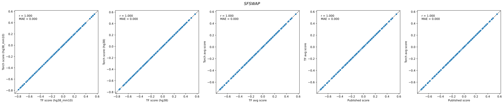
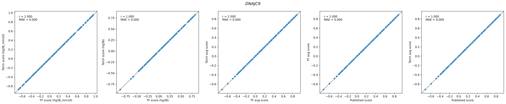

# promoterai-torch

A PyTorch port of [PromoterAI](https://github.com/Illumina/PromoterAI) v1 from Illumina — a deep learning model that predicts the regulatory impact of promoter DNA variants on gene expression.

> [!Important]
> This is **not** an official Illumina product or publication. The contents of this package are solely the responsibility of the authors/maintainers and its release should not be construed as being supported/endorsed by Illumina or the original authors of PromoterAI.

## Install

If you already have a PromoterAI-torch model and only wish to run inference/interpretation on it, you should install just the core dependencies:

```sh
pip install promoterai-torch
# or with uv:
uv add promoterai-torch
```

Converting a pretrained Keras/TensorFlow SavedModel (including the official releases from Illumina) requires additional TensorFlow dependencies:

```sh
pip install "promoterai-torch[convert]"
# or with uv:
uv add "promoterai-torch[convert]"
```

Fine-tuning or training from scratch using the built-in scripts requires a couple extra dependencies for data preprocessing:

```sh
pip install "promoterai-torch[train]"
# or with uv:
uv add "promoterai-torch[train]"
```

## Convert a pretrained Keras model

First install the `[convert]` extra (see above), then download the pretrained PromoterAI SavedModel from [Illumina/PromoterAI](https://github.com/Illumina/PromoterAI) and convert it to a PyTorch checkpoint:

```sh
promoterai-torch convert \
    --keras_model models/promoterAI_v1_hg38_mm10_finetune \
    --output models/promoterAI_v1_hg38_mm10_finetune.pt \
    --input_length 20480 \
    --output_length 4096
```

Architecture parameters (`num_blocks`, `model_dim`, `output_dims`) are inferred automatically from the Keras model. `--input_length` and `--output_length` are optional metadata.

## Quick start

### Score variants

Given a pretrained checkpoint and a variant TSV with columns `chrom`, `pos`, `ref`, `alt`, `strand`:

```sh
promoterai-torch score \
    --model_checkpoint models/promoterAI_v1_hg38_mm10_finetune.pt \
    --var_file variants.tsv \
    --fasta_file hg38.fa \
    --input_length 20480
```

Scores are written by default to `variants.{model_name}.tsv` as a new `score` column in [−1, 1] (or to a file path provided by `--output`). Thresholds: ±0.1 (weak effect), ±0.2 (moderate), ±0.5 (strong).

#### Numerical equivalence

Validated the `hg38_finetune` and `hg38_mm10_finetune` models against the original TF/Keras implementation on *TERT* (*n* = 6,006), *SFSWAP* (*n* = 3003), and *DNAJC9* (*n* = 9009) promoter variants. Scores are numerically identical across all comparisons — including the ensembled scores against the published PromoterAI output (Pearson r = 1.0000, MAE = 0.0000). See `examples/` for details.





### Run inference on a genomic sequence

One can also generate predictions for all the tracks that PromoterAI was trained on (these are aggregated and diff'ed to generate the variant scores).

```python
import torch
from promoterai_torch.dataset import onehot_encode
from promoterai_torch.utils import load_pretrained

model, args = load_pretrained("models/promoterAI_v1_hg38_mm10_finetune.pt")
model.eval()

# One-hot encode a DNA sequence → (L, 4), add batch dim → (1, L, 4)
# Use the full input_length the model was trained on (20480 bp for the published model)
seq = "ACGT" * (args["input_length"] // 4)   # replace with your sequence
x = torch.from_numpy(onehot_encode(seq)).unsqueeze(0)

with torch.no_grad():
    predictions = model(x)   # tuple of (1, output_length, n_tracks) per output head

track_predictions = predictions[0]   # (1, output_length, n_tracks) — arcsinh-scale signal
```

The output is one tensor per species head. Each tensor has shape `(batch, output_length, n_tracks)` where `n_tracks=498` for the published human head (histone marks, TF ChIP-seq, ATAC-seq, RNA-seq) and `n_tracks=??` for the mouse head.

### Extract embeddings

```python
import torch
from promoterai_torch.dataset import onehot_encode
from promoterai_torch.utils import load_pretrained

model, args = load_pretrained("model.pt")
model.eval()

seq = "ACGT" * (args["input_length"] // 4)   # replace with your sequence
x = torch.from_numpy(onehot_encode(seq)).unsqueeze(0)

with torch.no_grad():
    embeddings = model.encode(x)   # (1, input_length, model_dim)
```

`model.encode()` returns the final MetaFormer block output — a per-position representation of shape `(B, L, model_dim)` suitable for downstream tasks.

### DeepLIFT/SHAP attribution

The architecture uses named `nn.ReLU()` module instances (one per non-linearity) so it is compatible with [`tangermeme`](https://github.com/jmschrei/tangermeme)'s `deep_lift_shap`. Wrap the model to transpose the channels-first input expected by tangermeme and reduce the output to `(batch, 1)` (we average over positions and tracks in the demo script):

```python
import torch
import torch.nn as nn
from tangermeme.deep_lift_shap import deep_lift_shap
from promoterai_torch.utils import load_pretrained

model, args = load_pretrained("model.pt")
model.eval()

class PromoterAIWrapper(nn.Module):
    def __init__(self, model):
        super().__init__()
        self.model = model

    def forward(self, x):                           # x: (B, 4, L) channels-first
        out = self.model(x.transpose(1, 2))         # PromoterAI expects (B, L, 4)
        out = out[0].mean(dim=(1, 2)).unsqueeze(1)  # (B, 1) — mean over positions and tracks
        return out

wrapper = PromoterAIWrapper(model)

# x: (B, 4, input_length) one-hot, channels-first
x = torch.zeros(1, 4, args["input_length"])
x[0, 0, :] = 1.0  # replace with your sequences

attributions = deep_lift_shap(wrapper, x, n_shuffles=20, device="cuda", batch_size=1)
# attributions: (B, 4, input_length) — per-position, per-base importance
```


Do note that calculating DeepLIFT/SHAP on this model is quite expensive: with TF32, `n_shuffles=20`, and `batch_size=1`, it takes ~92s/sequence with ~71GB VRAM used on an A100 80GB.

## Training from scratch

> [!Warning]
> This functionality is completely untested; I have not verified whether any of this runs or is correct. It was just auto-ported by Claude because this function was present in the original PromoterAI repo. I may eventually need to use it, at which point this will receive more careful testing and development.

Preprocess one chromosome at a time (parallelizable), then train:

```sh
promoterai-torch preprocess \
    --hdf5_folder data/hdf5/human --tss_file tss_hg38.tsv \
    --fasta_file hg38.fa --bigwig_files hg38_tracks.tsv \
    --chrom chr1 --input_length 32768 --output_length 16384

promoterai-torch train \
    --checkpoint_folder checkpoints/run1 \
    --hdf5_human_folder data/hdf5/human \
    --input_length 20480 --output_length 4096 \
    --num_blocks 24 --model_dim 1024 --batch_size 32
```

Multi-GPU via `torchrun`:

```sh
torchrun --nproc_per_node=4 -m promoterai_torch.train \
    --checkpoint_folder checkpoints/run1 \
    --hdf5_human_folder data/hdf5/human \
    --hdf5_nonhuman_folders data/hdf5/mouse \
    --input_length 20480 --output_length 4096 \
    --num_blocks 24 --model_dim 1024 --batch_size 32
```

### Fine-tune on custom variants

```sh
promoterai-torch finetune \
    --model_checkpoint best_model.pt \
    --var_file data/annotation/finetune_gtex.tsv \
    --fasta_file hg38.fa \
    --input_length 20480 \
    --batch_size 8 \
    --epochs 100
```

The fine-tuned base model is saved to `best_model_finetune/best_model.pt`. Only the first output head is trained; all other weights are frozen.

The variant TSV must include `chrom`, `pos`, `ref`, `alt`, `strand`, `z` (expression z-score target), `in_cds`, `spliceai`, `p_under`, `p_over`, `gene` columns (matching the GTEx outlier format).

## Development

```sh
uv sync --extra dev
uv run pytest tests/ -v
```

## Reference

Jaganathan, Ersaro, Novakovsky et al. *Science* (2025) Predicting expression-altering promoter mutations with deep learning. doi:10.1126/science.ads7373
Original TF implementation: [Illumina/PromoterAI](https://github.com/Illumina/PromoterAI)
