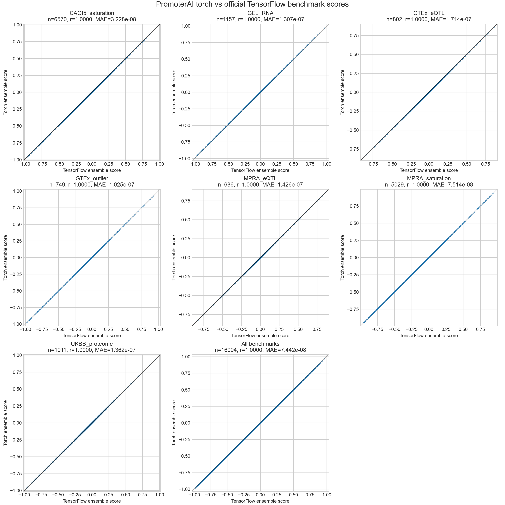

# Numerical equivalence

## Equivalence on benchmarks from paper

The public benchmark variant sets from
[Illumina/PromoterAI](https://github.com/Illumina/PromoterAI/tree/master/data/benchmark)
can be downloaded and scored with fine-tuned torch checkpoints. The
benchmark script reports under/over, under/null, and over/null AUROCs from
`hg38_finetune` scores, or from the average of signed `hg38_finetune` and
`hg38_mm10_finetune` variant scores when both checkpoints are provided:

```sh
python examples/paper_benchmark/download_benchmark_data.py \
    --output_dir data/benchmark

python examples/paper_benchmark/benchmark_variant_scores.py \
    --benchmark_dir data/benchmark \
    --hg38_finetune_checkpoint models/promoterAI_v1_hg38_finetune.pt \
    --hg38_mm10_finetune_checkpoint models/promoterAI_v1_hg38_mm10_finetune.pt \
    --fasta_file hg38.fa \
    --output_dir results/benchmark \
    --batch_size 2 \
    --device cuda
```

Per-dataset scored TSVs are written to `results/benchmark/*.scores.tsv`, and
the AUROC summary is written to `results/benchmark/benchmark_aurocs.tsv`.
Run one or more datasets by adding `--dataset GTEx_outlier` (repeatable). To
split each dataset across multiple GPUs, pass a device list:

```sh
python examples/paper_benchmark/benchmark_variant_scores.py \
    --benchmark_dir data/benchmark \
    --dataset GTEx_outlier \
    --hg38_finetune_checkpoint models/promoterAI_v1_hg38_finetune.pt \
    --hg38_mm10_finetune_checkpoint models/promoterAI_v1_hg38_mm10_finetune.pt \
    --fasta_file hg38.fa \
    --output_dir results/benchmark/GTEx_outlier \
    --batch_size 2 \
    --devices cuda:0 cuda:1 cuda:2 cuda:3
```

Omit `--hg38_mm10_finetune_checkpoint` to benchmark with only the
`hg38_finetune` checkpoint.

To benchmark the official TensorFlow/Keras SavedModels from
[Illumina/PromoterAI](https://github.com/Illumina/PromoterAI), install the
official `promoterai` package in an environment with TensorFlow and use the
matching TensorFlow script. This standalone script does not require installing
`promoterai-torch`.

```sh
python examples/paper_benchmark/benchmark_variant_scores_tf.py \
    --benchmark_dir data/benchmark \
    --dataset GTEx_outlier \
    --hg38_finetune_model_folder models/promoterAI_v1_hg38_finetune \
    --hg38_mm10_finetune_model_folder models/promoterAI_v1_hg38_mm10_finetune \
    --fasta_file hg38.fa \
    --output_dir results/benchmark_tf/GTEx_outlier \
    --batch_size 1 \
    --devices 0 1 2 3
```

After running both benchmark paths, open
`examples/paper_benchmark/plot_torch_vs_tensorflow_scores.ipynb` to make
per-dataset and combined scatterplots of torch versus TensorFlow ensemble
scores. This port and the original TF model produce near equivalent scores, and both also match the published AUROCs.



## Equivalence on (subset of) published all-promoter variants dataset

Validated the `hg38_finetune` and `hg38_mm10_finetune` models against the original TF/Keras implementation on *TERT* (*n* = 6,006), *SFSWAP* (*n* = 3003), and *DNAJC9* (*n* = 9009) promoter variants. Scores are identical across all comparisons, including the ensembled scores against the published PromoterAI variant scores (Pearson r = 1.0000, MAE = 0.0000). See `examples/` for details. Note that this repo follows the official PromoterAI and rounds variant scores to 4 decimal places.


The example scripts can also compare the full predicted regulatory tracks from the original TF/Keras SavedModel and the converted PyTorch checkpoint. This reports mean and max absolute error per input sequence and output head.

```sh
python examples/track_benchmark/compare_tf_torch_tracks_promoters.py \
    --keras_model models/promoterAI_v1_hg38_mm10_finetune \
    --torch_checkpoint models/promoterAI_v1_hg38_mm10_finetune.pt \
    --fasta hg38.fa \
    --promoter DNAJC9:chr10:73247254:- \
    --promoter TERT:chr5:1294988:- \
    --promoter SFSWAP:chr12:131710589:+

python examples/track_benchmark/compare_tf_torch_tracks_random.py \
    --keras_model models/promoterAI_v1_hg38_mm10_finetune \
    --torch_checkpoint models/promoterAI_v1_hg38_mm10_finetune.pt \
    --n_sequences 8 \
    --seed 0
```

Both track parity scripts default to a VRAM-safe separate-loop mode: TensorFlow
runs first in a child process, writes temporary memmaps, exits to release CUDA
memory, and then PyTorch runs. Pass `--interleaved` only for small debugging
runs where both runtimes fit in GPU memory.

Errors are ~1e-7 (<1e-4) when run at FP32, i.e., within machine precision, when comparing all four official TF/Keras SavedModels (`hg38`, `hg38_mm10`, `hg38_finetune`, and `hg38_mm10_finetune`) against their PyTorch checkpoints.
