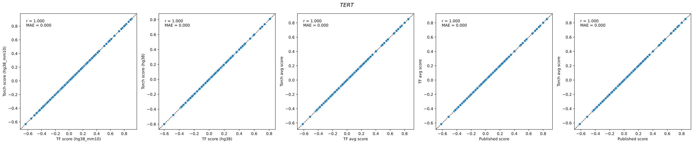
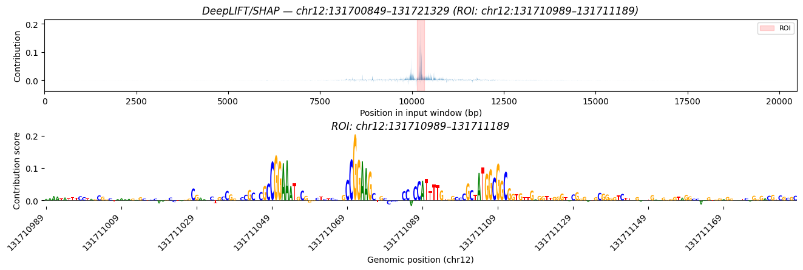

## Summary

PromoterAI (Jaganathan, Ersaro, Novakovsky et al., *Science* 2025) predicts how promoter variants alter gene expression, but the official release ships as a TensorFlow/Keras SavedModel. [`promoterai-torch`](https://github.com/genomicsxai/promoterai-torch) is an independent, numerically-equivalent PyTorch port that converts Illumina's checkpoints and makes variant scoring, track prediction, embedding extraction, and DeepLIFT/SHAP attribution available through the PyTorch/`tangermeme` ecosystem, with training and fine-tuning scripts included for anyone who wants to reproduce or extend the model from scratch.

## Overview

Promoter variants can silently break gene expression without touching a coding exon, and prioritizing which of them matter is a hard, unsolved problem in variant interpretation. PromoterAI addressed this by training a sequence-to-function model on hundreds of regulatory tracks (histone marks, TF ChIP-seq, ATAC-seq, RNA-seq) across human and mouse promoters, then fine-tuning on expression outlier variants (with signed differences between reference and alternate predictions as a variant effect score).

The catch for anyone working primarily in the PyTorch ecosystem: the official model is TensorFlow/Keras, and interpretability tooling (attribution, embeddings, downstream fine-tuning, sequence design) is often easiest to build on top of PyTorch. `promoterai-torch` re-implements the architecture (a MetaFormer-style stack with species-specific output heads) layer-for-layer in PyTorch, and ships a converter that reads an existing Illumina SavedModel and produces a `.pt` checkpoint with architecture hyperparameters inferred automatically.

> This is **not** an official Illumina product. The PyTorch code here is original, but the *weights* still come from Illumina's SavedModels, which remain under their original license — this repo does not redistribute converted checkpoints.

## Getting Started

The core package installs without pulling in TensorFlow, HDF5/BigWig tooling, or attribution libraries:

```sh
pip install promoterai-torch
```

Converting a pretrained checkpoint requires the `[convert]` extra and a copy of the official SavedModel from [Illumina/PromoterAI](https://github.com/Illumina/PromoterAI):

```sh
pip install "promoterai-torch[convert]"

promoterai-torch convert \
    --keras_model models/promoterAI_v1_hg38_mm10_finetune \
    --output models/promoterAI_v1_hg38_mm10_finetune.pt \
    --input_length 20480 \
    --output_length 4096
```

From there, scoring a variant TSV (`chrom`, `pos`, `ref`, `alt`, `strand`) is one command:

```sh
promoterai-torch score \
    --model_checkpoint models/promoterAI_v1_hg38_mm10_finetune.pt \
    --var_file variants.tsv \
    --fasta_file hg38.fa \
    --input_length 20480
```

Scores land in [−1, 1], with the same effect-size thresholds as the original paper (±0.1 weak, ±0.2 moderate, ±0.5 strong).

## Numerical Equivalence

Porting a model is only useful if it actually reproduces the original, so most of the engineering effort went here.

**Track-level equivalence.** Running both the original TF/Keras SavedModel and the converted PyTorch checkpoint on the same sequences and comparing every output track gives errors of ~1e-7 at FP32 — within machine precision — across all four released checkpoints (`hg38`, `hg38_mm10`, `hg38_finetune`, `hg38_mm10_finetune`).

**Variant-score equivalence.** On promoter variants at *TERT* (*n* = 6,006), *SFSWAP* (*n* = 3,003), and *DNAJC9* (*n* = 9,009), torch and TF/Keras variant scores are identical, including the ensembled score used in the paper (Pearson *r* = 1.0000, MAE = 0.0000). Note that the scoring script/CLI in both the official repo and this port round the score to 4 digits, which is why variant scores will generally be actually identical.



**Benchmark equivalence.** Scoring the public benchmark variant sets released alongside the paper (GTEx expression outliers, under/over/null splice-adjacent sets) with the torch checkpoints reproduces the published AUROCs, matching the TF/Keras ensemble scores nearly exactly.


## What Can You Do With This?

Beyond variant scoring, `load_pretrained()` exposes the full model for anything you'd normally do with a PyTorch sequence model:

- **Track prediction** — run inference on an arbitrary sequence and get back per-position predictions for all 498 human tracks the model was trained on (histone marks, TF ChIP-seq, ATAC-seq, RNA-seq), plus the mouse head.
- **Embeddings** — `model.encode()` returns the final MetaFormer block's per-position hidden state, `(B, L, model_dim)`, for use as input to downstream models or probing analyses.
- **DeepLIFT/SHAP attribution** — every non-linearity in the architecture is a distinct, named `nn.ReLU()` instance, which is exactly what [`tangermeme`](https://github.com/jmschrei/tangermeme)'s `deep_lift_shap` requires. A thin wrapper (transpose to channels-first, reduce the output heads to a scalar) is all that's needed to get per-base attribution maps.



Fair warning on cost: DeepLIFT/SHAP on this model is not cheap — at TF32 with `n_shuffles=20` and `batch_size=1`, expect ~92s and ~71GB of VRAM per sequence on an A100 80GB.

## Training and Fine-Tuning

The repo also includes the full training pipeline, not just inference: HDF5 preprocessing of track and sequence data per chromosome, multi-GPU training via `torchrun`, checkpoint/resume handling, and a fine-tuning script that trains only the first output head on a variant set (matching PromoterAI's own fine-tuning protocol on GTEx outlier data) while keeping the rest of the backbone — including BatchNorm statistics — frozen in inference mode.

```sh
promoterai-torch train \
    --checkpoint_folder checkpoints/run1 \
    --hdf5_human_folder data/hdf5/human \
    --input_length 20480 --output_length 4096 \
    --num_blocks 24 --model_dim 1024 --batch_size 32
```

This hasn't been used to reproduce Illumina's exact published model from scratch — that would require their full training corpus — but it has been verified to run end-to-end and to match the original's documented training/fine-tuning behavior wherever that behavior is checkable.

## Code and Tutorials

- Repository: [github.com/genomicsxai/promoterai-torch](https://github.com/genomicsxai/promoterai-torch)
- PyPI: [`promoterai-torch`](https://pypi.org/project/promoterai-torch/)
- Worked examples (paper benchmark reproduction, track-level parity checks, TERT/SFSWAP/DNAJC9 notebooks): [`examples/`](https://github.com/genomicsxai/promoterai-torch/tree/main/examples)

## License

`promoterai-torch`'s code is open source, but it is an independent port, not an Illumina product or publication, and its release should not be construed as endorsed or supported by Illumina or the original PromoterAI authors. The official codebase, models, and variant scores remain under Illumina's original (fairly restrictive) license — see [Illumina/PromoterAI](https://github.com/Illumina/PromoterAI) for academic/commercial licensing terms. Converted checkpoints should not be redistributed.

## Acknowledgements

This work builds directly on the architecture and training protocol described by Illumina's PromoterAI team, and on [`tangermeme`](https://github.com/jmschrei/tangermeme) for attribution tooling.

## References

1. Jaganathan, K., Ersaro, N., Novakovsky, G. et al. Predicting expression-altering promoter mutations with deep learning. *Science* 388, eads7373 (2025). https://doi.org/10.1126/science.ads7373
2. Illumina/PromoterAI (official TensorFlow implementation). https://github.com/Illumina/PromoterAI
3. Schreiber, J. tangermeme: A toolkit for understanding cis-regulatory logic using deep learning models. *bioRxiv* (2025). https://www.biorxiv.org/content/10.1101/2025.08.08.669296v2
